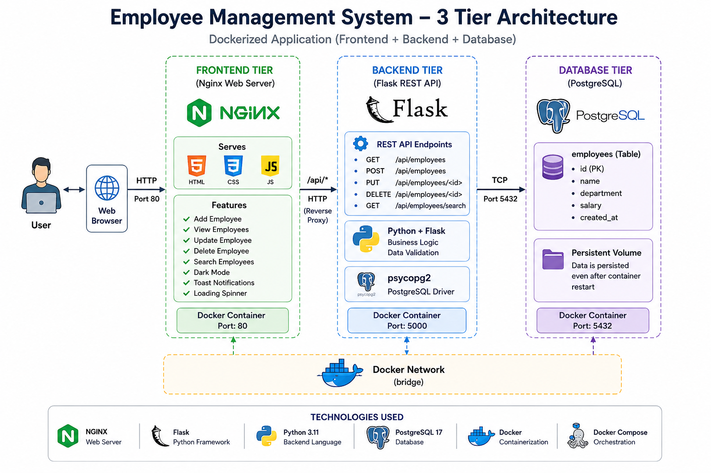

# Employee Management System 🚀

A production-style **3-tier Dockerized application** built using:

- Frontend: HTML + CSS + JavaScript + Nginx
- Backend: Python Flask REST API
- Database: PostgreSQL
- Containerization: Docker + Docker Compose


## 🏗️ Architecture




## 📌 Project Overview

This project demonstrates a complete 3-tier application architecture:


## ✨ Features

### Employee Management

✅ Add employee  
✅ View employees  
✅ Update employee  
✅ Delete employee  
✅ Search employees  


### Frontend Features

✅ Responsive dashboard  
✅ Dark mode  
✅ Toast notifications  
✅ Loading indicator  
✅ Search functionality  


### Backend Features

✅ REST APIs  
✅ Database integration  
✅ CRUD operations  
✅ Environment-based configuration  


## 🛠️ Technology Stack

| Layer | Technology |
|---|---|
| Frontend | HTML, CSS, JavaScript |
| Web Server | Nginx |
| Backend | Python Flask |
| Database | PostgreSQL 17 |
| Database Driver | psycopg2 |
| Containers | Docker |
| Orchestration | Docker Compose |


# 📂 Project Structure
employee-management-system/

├── backend/
│ ├── app.py
│ ├── requirements.txt
│ └── Dockerfile
│
├── frontend/
│ ├── index.html
│ ├── nginx.conf
│ └── Dockerfile
│
├── database/
│ └── init.sql
│
├── docker-compose.yml
└── README.md


# 🚀 Running The Application


## Clone Repository

```bash
git clone https://github.com/<username>/employee-management-system.git

cd employee-management-system
Start Containers
docker compose up -d --build
Verify Containers
docker ps

Expected:

frontend
backend
database
🌐 Access Application

Frontend:

http://localhost

Backend:

http://localhost:5000/api/employees
🔌 API Documentation
Get Employees
GET /api/employees

Example:

curl http://localhost:5000/api/employees
Add Employee
POST /api/employees

Example:

curl -X POST \
http://localhost:5000/api/employees \
-H "Content-Type: application/json" \
-d '
{
"name":"John",
"department":"Engineering",
"salary":80000
}'
Update Employee
PUT /api/employees/{id}

Example:

{
"name":"Alex",
"department":"IT",
"salary":90000
}
Delete Employee
DELETE /api/employees/{id}
Search Employee
GET /api/employees/search?q=name
🐳 Docker Architecture
Frontend Container

Purpose:

Serves UI using Nginx
Reverse proxies API requests

Port:

80
Backend Container

Purpose:

Handles business logic
Provides REST APIs

Port:

5000
Database Container

Purpose:

Stores employee records

Port:

5432

Persistent volume:

postgres-data
🔐 Environment Variables

Create:

backend/.env

Example:

DB_HOST=database
DB_NAME=employees
DB_USER=admin
DB_PASSWORD=admin123
DB_PORT=5432
🧪 Useful Docker Commands

View logs:

docker compose logs -f

Stop application:

docker compose down

Restart:

docker compose restart
🧠 Key DevOps Concepts Demonstrated
Docker networking
Container communication
Persistent volumes
Environment variables
Reverse proxy
Multi-container deployment
REST API integration
🔮 Future Improvements
Kubernetes deployment
GitHub Actions CI/CD
AWS deployment
Authentication using JWT
Monitoring using Prometheus/


Author

Shubham Pandey

DevOps / Backend Project
